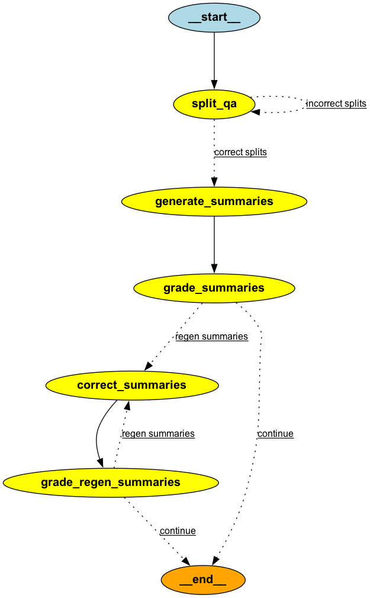

# Summary Note Generation Agent

This agent system is designed to transform intake forms filled out by patients, containing question-and-answer pairs (typically with short answers), into concise, human-readable summary notes. The agent uses a state-based workflow defined with LangGraph to accomplish this.

## Key Features

- **Input Parsing:** The system reads a JSON-formatted input that contains questions and their respective answers.
- **Categorization:** The questions and answers are categorized based on their content, allowing for organized and relevant summaries.
- **Summary Generation:** Generates human-readable notes based on the categorized content.
- **Summary Correction:** In case of incorrect categorizations or summaries, the system iterates through a correction and regeneration loop until acceptable results are produced.
- **Grading and Decision Making:** Summaries are graded for accuracy, and decisions are made on whether corrections are needed or if the final summary can be accepted.

## Workflow Overview

1. **Split QA:** The system first splits the question-answer (QA) pairs from the JSON input.
    - If the splits are correct, the workflow proceeds to generate summaries.
    - If splits are incorrect, the process loops back to correct them.
2. **Generate Summaries:** Based on the categorized QA pairs, the system generates initial summaries.
3. **Grade Summaries:** The generated summaries are evaluated for accuracy.
    - If the summaries are acceptable, the process ends.
    - If not, the workflow moves on to correct the summaries.
4. **Correct Summaries:** The system corrects any detected issues in the summaries.
5. **Grade Regenerated Summaries:** The corrected summaries are graded again.
    - If acceptable, the process ends.
    - Otherwise, the correction loop is repeated.

## Input and Output

The input to this system is a set of questions and answers filled out by the patient. The output is a human-readable summary note, such as: _"Patient reports vomiting without any visible blood in the vomit."_

